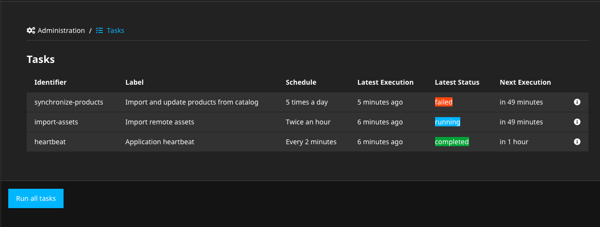
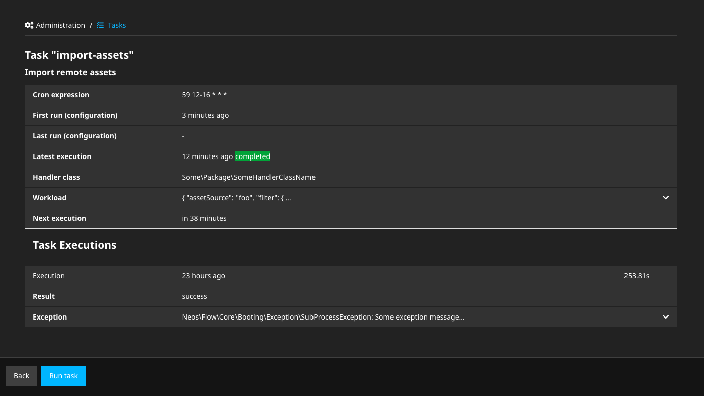

# Wwwision.Neos.TaskModule

Neos Backend Module for the [Flowpack.Task](https://github.com/Flowpack/task) task scheduler:





## Usage

Install package via composer:

    composer require wwwision/neos-taskmodule

And navigate to the new `tasks` module at /neos/administration/tasks

### Access control

This module is accessible for `Neos.Neos:Administrator` only by default but the access level can be
granted to roles via `Policy.yaml`:

```yaml
roles:
  'Some.Package:SomeRole':
    privileges:
      - privilegeTarget: 'Wwwision.Neos.TaskModule:Module'
        permission: GRANT
```

This would grant uses with the role `Some.Package:SomeRole` access to the module itself.

To allow users to schedule individual or all tasks, the `Wwwision.Neos.TaskModule:Tasks.RunSingle`
and/or `Wwwision.Neos.TaskModule:Tasks.RunAll` privilege targets can be granted, too.

## Contribution

Contributions in the form of issues or pull requests are highly appreciated.
Please note: This package is mainly a UI for [Flowpack.Task](https://github.com/Flowpack/task). Bugs and feature requests
for the core functionality should be reported there.

## License

See [LICENSE](./LICENSE)
